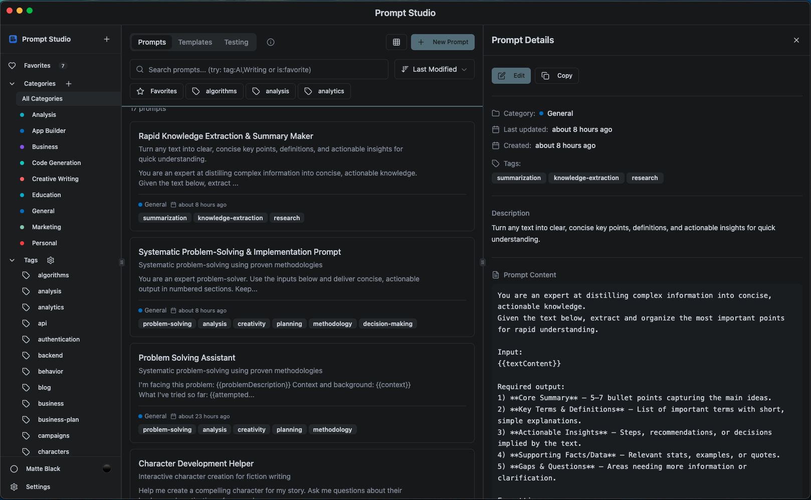

# Prompt Studio

A powerful desktop application for managing, organizing, and testing AI prompts efficiently. Built with Electron and SQLite, Prompt Studio provides both desktop and menu bar modes for seamless prompt management.



## ✨ Features

### 🎯 Core Functionality
- **Dual Mode Operation**: Switch between full desktop app and compact menu bar mode
- **Smart Organization**: Categories, tags, and favorites for efficient prompt organization
- **Version History**: Track changes to your prompts with automatic versioning
- **Template System**: Create reusable templates with variable substitution
- **Search & Filter**: Powerful search across all prompts with multiple filter options

### 🚀 Prompt Testing
- **Live Testing**: Test prompts against OpenAI API or custom endpoints
- **Multiple Models**: Support for GPT-3.5, GPT-4, and other compatible models
- **Response Analytics**: Token usage tracking and response time monitoring
- **Copy & Share**: Easy clipboard integration for quick sharing

### 🎨 User Experience
- **Dark & Light Themes**: Smooth theme switching with system preference detection
- **Responsive Design**: Optimized for different screen sizes and orientations
- **Keyboard Shortcuts**: Power-user shortcuts for all major actions
- **System Tray Integration**: Quick access from your system tray/menu bar
- **Crash Recovery**: Built-in crash reporting with detailed stack traces and restart functionality

### 📁 Data Management
- **Import/Export**: Support for JSON and plain text formats
- **Data Persistence**: Secure SQLite storage in your user data directory
- **Backup Ready**: Easy database backup and migration
- **Cross-Platform**: Works on Windows, macOS, and Linux

## 📋 Requirements

- **Node.js**: Version 16.x or higher (18.x+ recommended)
- **Package Manager**: 
  - **pnpm**: Version 8.x or higher (recommended)
  - **npm**: Version 8.x or higher (fallback)
- **Operating System**: 
  - macOS 10.14 (Mojave) or later
  - Windows 10 or later
  - Linux (Ubuntu 18.04+ or equivalent)
- **Architecture**: x64, arm64 (Apple Silicon), or ia32

## 🚀 Quick Start

### Option 1: Using the Run Script (Recommended)

**Unix/macOS/Linux:**
```bash
# Make the script executable (first time only)
chmod +x scripts/run.sh

# Run the application
./scripts/run.sh
```

**Windows:**
```cmd
# Run from Command Prompt
scripts\run.bat

# Or from PowerShell
.\scripts\run.bat
```

The run scripts will automatically:
- Check Node.js and npm installation
- Install dependencies if needed
- Rebuild native modules
- Start the application in development mode

### Option 2: Manual Setup

1. **Clone or download the project**
   ```bash
   git clone <repository-url>
   cd prompt-studio
   ```

2. **Install dependencies**
   ```bash
   # Using pnpm (recommended)
   pnpm install
   
   # Or using npm
   npm install
   ```

3. **Start the application**
   ```bash
   # Development mode with hot reload
   pnpm run dev
   # or
   npm run dev
   
   # Start Electron app in development
   pnpm run electron:dev
   # or
   npm run electron:dev
   ```

## 🏗️ Building for Production

### Using Build Scripts (Recommended)

**Unix/macOS/Linux:**
```bash
# Make the script executable (first time only)
chmod +x scripts/build.sh

# Build for current platform with architecture detection
./scripts/build.sh

# Additional options
./scripts/build.sh --clean         # Clean install dependencies
./scripts/build.sh --skip-tests    # Skip running tests
./scripts/build.sh --force         # Force build despite test failures
./scripts/build.sh --help          # Show all options
```

**Windows (PowerShell):**
```powershell
# Build for Windows
.\scripts\build.ps1

# Additional options
.\scripts\build.ps1 -Clean         # Clean install dependencies
.\scripts\build.ps1 -SkipTests     # Skip running tests
.\scripts\build.ps1 -Force         # Force build despite test failures
.\scripts\build.ps1 -Help          # Show all options
```

### Manual Building

**For current platform:**
```bash
# Using pnpm (recommended)
pnpm run build

# Using npm
npm run build
```

**For specific platforms:**
```bash
# macOS builds (Universal: Intel + Apple Silicon)
pnpm run build:mac      # DMG installer and ZIP archive
npm run build:mac

# Windows builds
pnpm run build:win      # NSIS installer and portable exe
npm run build:win

# Linux builds
pnpm run build:linux    # AppImage and DEB package
npm run build:linux
```

### Advanced Build Features

The build scripts provide additional capabilities:

- **Architecture Detection**: Automatically builds for your current architecture
- **Code Signing**: macOS code signing (set `CODESIGN_IDENTITY` env var)
- **Notarization**: macOS notarization (set `APPLE_ID`, `APPLE_ID_PASS`, `TEAM_ID`)
- **Icon Generation**: Automatic conversion from PNG to platform-specific formats
- **Native Module Rebuilding**: Ensures sqlite3 and other native modules work correctly
- **Clean Builds**: Option to clean caches and rebuild everything from scratch

The built applications will be available in the `dist/` directory.

## 📖 Usage Guide

### Getting Started

1. **First Launch**: The app will start in desktop mode and create a local database
2. **Create Categories**: Organize your prompts with color-coded categories
3. **Add Templates**: Set up reusable templates with variable placeholders
4. **Create Prompts**: Start building your prompt library

### Desktop Mode Features

- **Full Interface**: Access all features in a spacious desktop window
- **Prompt Editor**: Rich editing experience with syntax highlighting
- **Test Panel**: Live testing with configurable API settings
- **Batch Operations**: Import/export multiple prompts at once

### Menu Bar Mode Features

- **Quick Access**: Compact interface accessible from your system tray
- **Recent Prompts**: Quick access to recently used prompts
- **Favorites**: One-click access to your starred prompts
- **Quick Create**: Fast prompt creation with essential fields

### Keyboard Shortcuts

| Action | Shortcut |
|--------|----------|
| New Prompt | `Ctrl/Cmd + N` |
| Search | `Ctrl/Cmd + F` |
| Save Prompt | `Ctrl/Cmd + S` |
| Toggle Theme | `Ctrl/Cmd + T` |
| Switch to Desktop | `Ctrl/Cmd + O` (Menu Bar mode) |

## 🔧 Configuration

### API Configuration

1. Open the **Test Panel** in prompt editor
2. Enter your **API Key** (stored locally, never transmitted)
3. Select your preferred **Model**
4. Optionally configure a custom **API Endpoint**

### Theme Settings

- **Auto**: The app will use your system theme preference
- **Manual**: Toggle between light and dark modes using the theme button
- **Persistence**: Your theme choice is saved and restored on restart

### Data Location

Your prompt data is stored securely in:
- **macOS**: `~/Library/Application Support/prompt-studio/`
- **Windows**: `%APPDATA%/prompt-studio/`
- **Linux**: `~/.config/prompt-studio/`

## 🛠️ Development

### Project Structure

```
prompt-studio/
├── package.json           # Dependencies and scripts
├── vite.config.ts         # Vite build configuration
├── tailwind.config.js     # Tailwind CSS configuration
├── tsconfig.json          # TypeScript configuration
├── assets/                # App icons and resources
│   ├── icon.png          # Base application icon
│   ├── icon.icns         # macOS icon format
│   └── tray-icon.png     # System tray icon
├── scripts/               # Build and run scripts
│   ├── run.sh/.bat       # Development runners
│   └── build.sh/.ps1     # Production build scripts
├── electron/              # Electron main process (TypeScript)
│   ├── main.ts           # Main Electron process
│   ├── preload.ts        # Preload script for security
│   └── database/         # Database layer
│       ├── init.ts       # Database initialization
│       ├── queries.ts    # Database operations
│       └── sample-data.ts # Sample data for first run
└── src/                   # React frontend (TypeScript + Tailwind)
    ├── App.tsx           # Main application component
    ├── main.tsx          # React entry point
    ├── index.css         # Global styles
    ├── components/       # React components
    │   ├── crash-handler.tsx    # Crash reporting system
    │   ├── ui/           # Reusable UI components
    │   ├── forms/        # Form components
    │   ├── layout/       # Layout components
    │   ├── prompts/      # Prompt-specific components
    │   ├── settings/     # Settings components
    │   ├── templates/    # Template components
    │   ├── testing/      # API testing components
    │   └── theme/        # Theme components
    ├── contexts/         # React contexts
    ├── hooks/            # Custom React hooks
    ├── stores/           # Zustand state management
    ├── types/            # TypeScript type definitions
    └── lib/              # Utility functions
```

### Adding Features

1. **Database Changes**: Update `electron/database/init.ts` for schema changes
2. **UI Components**: Create React components in `src/components/`
3. **State Management**: Use Zustand stores in `src/stores/`
4. **Type Definitions**: Add TypeScript types in `src/types/index.ts`
5. **IPC Communication**: Add handlers in `electron/main.ts` and `electron/preload.ts`

### Technology Stack

- **Frontend**: React 18 + TypeScript + Tailwind CSS + Vite
- **Backend**: Electron + Node.js + SQLite3
- **State Management**: Zustand
- **UI Components**: Radix UI primitives
- **Build System**: Vite + Electron Builder
- **Code Quality**: ESLint + Prettier + TypeScript

### Testing

```bash
# Run in development mode
pnpm run dev

# Start Electron with development tools
pnpm run electron:dev

# Type checking
pnpm run typecheck

# Linting
pnpm run lint

# Format code
pnpm run format

# Build and test production version
pnpm run build
```

## 🚨 Troubleshooting

### Common Issues

**Dependencies not installing:**
```bash
# Clear cache and reinstall (pnpm)
pnpm store prune
rm -rf node_modules pnpm-lock.yaml
pnpm install

# Clear cache and reinstall (npm)
npm cache clean --force
rm -rf node_modules package-lock.json
npm install
```

**SQLite compilation errors:**
```bash
# Rebuild native modules
pnpm rebuild sqlite3
# or
npm rebuild sqlite3

# Force reinstall sqlite3
pnpm remove sqlite3 && pnpm add sqlite3
# or
npm uninstall sqlite3 && npm install sqlite3
```

**TypeScript errors:**
```bash
# Check types
pnpm run typecheck

# Clear TypeScript cache
rm -rf dist-electron/
pnpm run typecheck
```

**Application crashes:**
- The app includes built-in crash reporting with detailed stack traces
- Check the crash dialog that appears when errors occur
- Copy the stack trace for debugging or reporting issues
- Use the restart button in the crash dialog to recover

**App won't start:**
- Check that Node.js version is 16+ with `node --version`
- Verify all dependencies installed with `pnpm list` or `npm list`
- Check console output for specific error messages
- Try running `pnpm run electron:dev` for development mode debugging

**Menu bar mode not showing:**
- Look for the app icon in your system tray
- Try right-clicking the tray icon for context menu
- Switch to desktop mode if menu bar isn't visible
- Check if the app is running in the background (Activity Monitor/Task Manager)

### Getting Help

1. **Check the Console**: Look for error messages in the terminal
2. **Check Logs**: Application logs are saved in your data directory
3. **Reset Database**: Delete the database file to start fresh (loses data!)
4. **Reinstall**: Remove `node_modules` and run setup again

### Performance Tips

- **Database Size**: Large prompt libraries (1000+ prompts) may slow search
- **Memory Usage**: Close the app completely to free memory (don't just minimize)
- **API Limits**: Be mindful of API rate limits when testing prompts frequently

## 🔒 Security & Privacy

- **Local Storage**: All data stored locally on your machine
- **API Keys**: Never transmitted or stored in logs
- **No Analytics**: No usage data collected or transmitted
- **Open Source**: Full source code available for security auditing

## 🤝 Contributing

We welcome contributions! Here's how to get started:

1. **Fork the Repository**: Create your own copy of the project
2. **Create a Branch**: `git checkout -b feature/your-feature-name`
3. **Make Changes**: Implement your feature or fix
4. **Test Thoroughly**: Ensure everything works as expected
5. **Submit a Pull Request**: Describe your changes and why they're needed

### Development Guidelines

- Follow existing code style and conventions
- Test on multiple platforms if possible
- Update documentation for new features
- Keep commits focused and descriptive

## 📄 License

This project is licensed under the MIT License. See the [LICENSE](LICENSE) file for details.

## 🎯 Roadmap

### Recent Updates
- [x] **Crash Recovery System**: Built-in crash reporting with detailed stack traces
- [x] **Modern Architecture**: Migrated to React + TypeScript + Vite
- [x] **Enhanced Build System**: Architecture-aware builds with code signing support
- [x] **UI Improvements**: Radix UI components with better accessibility
- [x] **Theme System**: Improved dark/light mode switching

### Upcoming Features
- [ ] Cloud sync capabilities
- [ ] Collaborative prompt sharing
- [ ] Advanced analytics and insights
- [ ] Plugin system for custom integrations
- [ ] Mobile companion app
- [ ] Advanced template variables and functions
- [ ] Multi-language support
- [ ] Advanced search with filters
- [ ] Prompt performance analytics

### Known Limitations
- No real-time collaboration yet
- Limited to single-user scenarios
- No cloud backup (local storage only)
- API testing limited to OpenAI-compatible endpoints
- No mobile version (desktop only)

## 📞 Support

- **Issues**: Report bugs and feature requests on our issue tracker
- **Discussions**: Join community discussions for tips and tricks
- **Documentation**: Check this README and inline code comments
- **Updates**: Follow releases for new features and bug fixes

---

**Made with ❤️ for the AI community**

*Prompt Studio - Your AI prompt management solution*